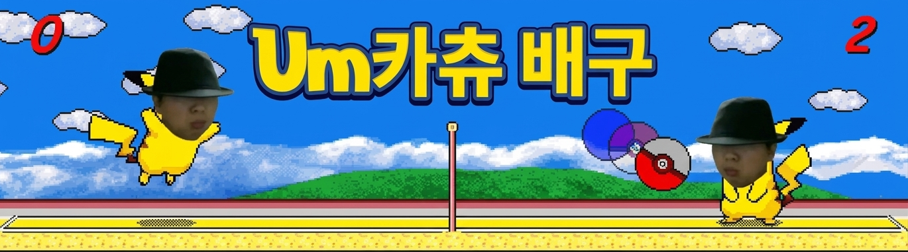

<p align="center">
  
</p>

<h1 align="center">⚡ 엄카츄 배구 엄랭 포트 ⚡</h1>

<p align="center">
  <strong>피카츄배구를 엄랭으로 끌고 가는 프로젝트입니다. 길어져도 됩니다. 돌아가면 됩니다.</strong>
</p>

<p align="center">
  <a href="README.md">English README</a>
  ·
  <a href="#-quick-start">Quick Start</a>
  ·
  <a href="#-코어-엄랭-샘플">코어 엄랭 샘플</a>
  ·
  <a href="#-작동하나">작동하나?</a>
</p>

---

## 📚 Index

| 섹션 | 내용 |
| --- | --- |
| [이게 뭐야?](#-이게-뭐야) | 레포 목표와 솔직한 포팅 경계. |
| [엄랭 context](#-엄랭-context) | 이 레포에서 엄랭이 어떻게 실행되는지. |
| [Quick Start](#-quick-start) | 작은 엄랭 샘플 실행 후 전체 게임 엄랭 생성/실행. |
| [코어 엄랭 샘플](#-코어-엄랭-샘플) | 실제 커밋된 `.umm` 파일로 동작 원리 보기. |
| [아키텍처](#-아키텍처) | 엄랭 script -> Rust VM -> Host API -> macroquad. |
| [작동하나?](#-작동하나) | 검증된 것과 로컬 GUI/audio에 의존하는 것. |
| [현실 체크](#-현실-체크) | 왜 아직 Rust-free 순수 엄랭 런타임이 아닌지. |
| [조작](#-조작) | 키보드 조작. |
| [개발](#-개발) | 재생성/검증 명령. |

## 🟡 이게 뭐야?

`umkachu-volleyball-umlang`는 피카츄배구 전용 동작을 최대한 **엄랭** 코드와 text ABI 파일로
밀어내는 전체 포팅 실험입니다.

지금 레포는 “Rust가 사라졌다”고 속이는 구조가 아닙니다. Rust는 범용 **엄랭 VM + Host API**이고,
엄랭이 실제 컴퓨터의 창, GPU, 키보드, 오디오, 파일, 설정, frame pacing을 호출할 수 있게 해주는
브리지입니다. 게임 전용 상태, 렌더 선언, 상수, 타이밍, SFX 정책, 키 매핑, 동작은 생성 엄랭과
`umlang-*.txt` ABI 파일로 계속 이동시키는 구조입니다.

```text
엄랭은 게임의 vibe와 게임 전용 동작을 가진다.
Rust는 범용 실행기와 OS/GPU/audio/keyboard 브리지를 가진다.
```

## 🧠 엄랭 Context

이 레포에서 **엄랭**은 게임 쪽 언어입니다. `.umm` 파일은 `어떻게`로 시작하고,
`이 사람이름이냐ㅋㅋ`로 끝납니다. `어/엄`으로 변수 슬롯에 숫자를 넣고, `식...!`로 출력하거나
Host API를 호출하고, `준...`으로 줄 번호 점프를 합니다.

작은 감각은 이렇습니다.

| 엄랭 모양 | 이 실행기에서의 의미 |
| --- | --- |
| `어떻게` | 프로그램 시작. |
| `이 사람이름이냐ㅋㅋ` | 프로그램 끝. |
| `엄.....` | 변수 슬롯 1에 값 저장. |
| `어엄.....` | 변수 슬롯 2에 값 저장. |
| `식어!` | 출력 실행. 음수 값이면 Host API syscall. |
| `준.....` | 줄 번호로 점프. |

겉보기에는 밈인데, VM 입장에서는 실제 실행 명령입니다.

## 🚀 Quick Start

### 1. 커밋된 작은 엄랭 코트 실행

레포에 들어 있는 홍보용 미니 샘플입니다.

```bash
cargo run -- examples/umkachu-core.umm
```

같은 실행기를 통해 실제 엄랭이 돌고, Host API syscall로 작은 엄카츄 코트를 그립니다.

### 2. 전체 게임 엄랭 파일 생성

전체 `scripts/pikachu.umm`는 로컬에서 생성합니다. 파일이 약 901MB라 GitHub 100MB 제한 때문에
커밋하지 않습니다.

```bash
python3 tools/gen_pikachu_umm.py
```

### 3. 엄카츄 배구 실행

```bash
cargo run
```

평범한 셸 명령이 실행하는 payload는 이런 느낌입니다.

```umm
어떻게
엄..........
어엄,,,,,
식어!
준..........
이 사람이름이냐ㅋㅋ
```

## 🧩 코어 엄랭 샘플

커밋된 샘플은 [`examples/umkachu-core.umm`](examples/umkachu-core.umm)에 있습니다.

큰 생성 게임이 쓰는 핵심 루프를 작게 보여줍니다.

```text
1. 변수 1에 음수 Host API opcode를 넣는다.
2. 변수 2, 3, 4...에 syscall 인자를 넣는다.
3. `식어!`를 실행한다.
4. Rust 엄랭 VM이 음수 값을 보고 Host API를 호출한다.
5. Host API가 사각형, 원, 숫자, frame yield를 처리한다.
6. `준...`으로 렌더 루프에 다시 점프한다.
```

예시 일부:

```umm
어떻게
엄,,,,,,,,,,
어엄....................
어어엄.... .........................................................................
어어어엄............. ....
어어어어엄................ ..
어어어어어엄..
식어!
엄,,,,,,,,,
식어!
준................. ..
이 사람이름이냐ㅋㅋ
```

이 조각은 `SYS_DRAW_NUMBER`를 호출하고, `SYS_WAIT_FRAME`으로 한 프레임을 넘긴 다음,
다시 렌더 루프로 점프합니다.

## 🏗 아키텍처

```text
umlang-package.txt
  -> scripts/pikachu.umm                 # 로컬 생성 전체 엄랭 게임
  -> examples/umkachu-core.umm           # 커밋된 작은 엄랭 코트 샘플
  -> umlang-*.txt                        # 게임 데이터 소유 ABI
  -> Rust 엄랭 VM                         # 피카츄 전용이 아닌 범용 실행기
  -> Host API(syscall)                   # 그래픽/입력/오디오/설정 브리지
  -> macroquad 창/GPU/키보드/오디오
```

| 레이어 | 책임 |
| --- | --- |
| `examples/umkachu-core.umm` | 루프 도는 작은 엄카츄 코트를 그리는 커밋된 엄랭 샘플. |
| `scripts/pikachu.umm` | 현재 전체 게임 루프와 게임 동작을 담은 로컬 생성 엄랭 프로그램. |
| `umlang-*.txt` | 상수, 렌더 배치, 타이밍, 메뉴 커브, SFX 정책, 변수, 키, 자산, RNG, 스프라이트, 애니메이션, 설정 ABI. |
| Rust VM | 엄랭 문법 실행: 변수, 식, 점프, 조건, 출력, 종료, 음수 출력 syscall. |
| Host API | 엄랭이 그래픽, 입력, 오디오, 설정, frame pacing, 산술 helper를 호출하는 경계. |
| macroquad | 창, GPU 렌더링, 키보드, 오디오를 담당하는 교체 가능한 backend. |

## ✅ 작동하나?

짧게 말하면: **실행기는 빌드되고, 생성 엄랭은 parse되고, 테스트에서 첫 프레임 yield까지 도달합니다.**

검증되는 것:

| 체크 | 의미 |
| --- | --- |
| `python3 -m py_compile tools/gen_pikachu_umm.py` | generator Python 문법 정상. |
| `cargo fmt --check` | Rust formatting 정상. |
| `cargo check` | Rust 엄랭 VM/Host API 빌드 정상. |
| `cargo test generated_pikachu_script_reaches_first_frame_yield` | 생성된 `scripts/pikachu.umm`가 parse되고 첫 frame yield까지 감. |

로컬 환경에 의존하는 것:

| 런타임 조각 | 이유 |
| --- | --- |
| Window/GPU/audio | macroquad가 로컬 GUI/audio 가능한 환경을 필요로 함. |
| 전체 gameplay 체감 | 생성 script가 매우 커서 로컬 실행 성능 영향을 받음. |

## ⚠️ 현실 체크

| 요구한 순수 엄랭 꿈 | 현재 솔직한 상태 |
| --- | --- |
| 그래픽/오디오/키보드까지 전부 엄랭 | 이 레포의 엄랭은 자체 OS/GPU/audio/keyboard 런타임이 없어서 Rust Host API가 담당. |
| `scripts/pikachu.umm` 직접 커밋 | 생성 파일이 약 901MB라 GitHub에 직접 커밋하지 않고 로컬 생성 방식으로 둠. |
| 전체 로직의 순수 수작업 엄랭화 | 생성 결과가 거대해서 Python generator가 엄랭을 생성함. 수작업 29만 줄 편집은 유지보수 불가. |
| Rust 완전 제거 | 아직 불가능. Rust는 현재 엄랭 실행기 + OS/GPU/audio 브리지 역할. |

따라서 지금의 정직한 목표는 이겁니다.

```text
게임 전용 동작은 엄랭으로 옮긴다.
실제 컴퓨터와 붙는 책임은 범용 실행기 경계 뒤에 둔다.
```

## 📦 패키지 ABI

| ABI | 소유 데이터 |
| --- | --- |
| `umlang-package.txt` | main script, asset root, VM frame budget, 설정 prefix, 창 옵션. |
| `umlang-syscalls.txt` | Rust와 엄랭 생성기가 공유하는 Host opcode 번호. |
| `umlang-keycodes.txt`, `umlang-keymap.txt` | physical key code와 게임 action 매핑. |
| `umlang-assets.txt` | texture/audio slot, BGM/SFX bank, asset id 정책 입력. |
| `umlang-palette.txt` | color id와 RGBA 팔레트. |
| `umlang-settings.txt` | 런타임 설정 key/default/allowed values. |
| `umlang-vars.txt` | 생성 엄랭 VM 변수 slot ABI. |
| `umlang-game.txt` | 게임 상수, 물리, phase, 코트/플레이어/공 기본값. |
| `umlang-player.txt` | 플레이어 상태 id와 이동/파워/누움/승패 상태 전이 임계값. |
| `umlang-sprites.txt` | player/ball atlas frame 좌표. |
| `umlang-rng.txt` | 원본식 64비트 LCG seed/multiplier byte. |
| `umlang-render.txt` | 배경, 점수, 인트로, 메뉴, phase 메시지, 플레이필드 렌더 배치. |
| `umlang-animation.txt` | 플레이어 상태별 animation rule과 draw-state sprite map. |
| `umlang-sfx.txt` | Round/UI SFX event flag, sound id, side policy. |
| `umlang-timing.txt` | intro/menu/phase fade frame, message growth, ready blink, game-end timing. |
| `umlang-menu.txt` | 메뉴 sitting tile, fight message pulse, title curve, selected option pulse. |

## 🎮 조작

| 키 | 동작 |
| --- | --- |
| 방향키 / ABI에 매핑된 이동키 | 플레이어 이동. |
| Power key | phase에 따라 jump/power/dive/menu confirm. |
| `Space` | 일시정지/재개. |
| `Backspace` | 인트로 재시작. |
| `P` | 연습모드 토글. |
| `1`, `2`, `3` | 승점 5/10/15. |
| `[`, `]`, `\` | 목표 FPS 20/30/25. |
| `B` | BGM 토글. |
| `S` | SFX Stereo/Mono/Off 순환. |
| `X` | soft/sharp texture filter. |

## 🛠 개발

`scripts/pikachu.umm`는 직접 고치지 말고 재생성하세요.

```bash
python3 tools/gen_pikachu_umm.py
cargo fmt --check
cargo check
cargo test generated_menu_abi_defines_original_menu_animation_curves
cargo test generated_pikachu_script_reaches_first_frame_yield
```

전체 `cargo test`도 가능하지만, 거대한 생성 엄랭 파일을 test binary에 포함해서 느릴 수 있습니다.

## 🧾 출처

README에는 다른 사람 이름을 노출하지 않고, 자산 출처와 재배포 주의사항은
[`docs/attribution.md`](docs/attribution.md)에 분리했습니다.
