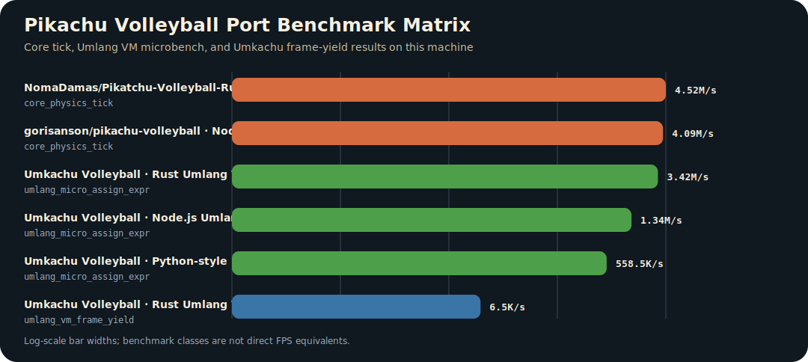

<p align="center">
  
</p>

<h1 align="center">⚡ 엄카츄 배구 ⚡</h1>

<p align="center">
  <strong>피카츄배구를 커밋된 엄랭 게임 패키지로 실행하는 Rust 엄랭 VM 프로젝트.</strong>
</p>

<p align="center">
  <a href="README.md">English README</a>
  ·
  <a href="#-quick-start">Quick Start</a>
  ·
  <a href="#-core-of-umkachu">Core of Umkachu</a>
  ·
  <a href="#-아키텍처">아키텍처</a>
  ·
  <a href="#-패키지-abi">패키지 ABI</a>
</p>

---

## 📚 Index

| 섹션 | 핵심 |
| --- | --- |
| [About this project](#-about-this-project) | 엄카츄 배구를 엄랭 우선 게임 패키지로 다루는 방식. |
| [What is Umkachu?](#-what-is-umkachu) | 피카츄배구를 엄랭으로 adaptation한 구조. |
| [Quick Start](#-quick-start) | 전체 `.umm` 패키지와 작은 코어 샘플 실행. |
| [Core of Umkachu](#-core-of-umkachu) | 엄카츄 배구가 쓰는 실제 엄랭 샘플 코드. |
| [아키텍처](#-아키텍처) | 엄랭 소스, 패키지 ABI, Rust VM, Host API, macroquad backend. |
| [패키지 ABI](#-패키지-abi) | `package/abi/`로 모은 ABI 파일들. |
| [Future Work](#-future-work-한국어로-코딩하는-가능성) | 한국어 로직과 맥락을 프로그래밍 언어 표면으로 옮기는 실험. |
| [Benchmark](#-프로파일링-benchmark) | Rust, Node.js, Python 스타일 엄랭 실행 성능 비교. |
| [Pikachu Volleyball port 비교](#pikachu-volleyball-port-비교) | 원본, JavaScript, Rust, 엄카츄 벤치마크 비교. |
| [Research](#-research) | 난해어 IR, private dialect 보안, agent 최적화 개발. |
| [조작](#-조작) | 키보드 조작. |
| [개발](#-개발) | Rust-only 빌드와 검증 명령. |

## 🟡 About this project

`umkachu-volleyball-umlang`는 피카츄배구를 **엄랭** 소스 패키지로 실행합니다.

```text
scripts/pikachu.umm
  -> 가져와 scripts/pikachu_parts/pikachu_0000.umm
  -> 가져와 scripts/pikachu_parts/pikachu_0001.umm
  -> ...
```

`.umm` 파일들이 게임 쪽 프로그램입니다. Rust는 언어 실행기입니다. 엄랭을 파싱하고, `가져와`
import를 펼치고, 변수/점프/출력 명령을 실행하고, 창/텍스처/오디오/키보드/설정/타이밍/frame pacing을
Host API로 연결합니다.

```text
엄랭은 게임 패키지를 가진다.
Rust는 그 패키지가 실제 기계와 통신할 수 있게 하는 VM/backend를 가진다.
```

이 레포는 Rust 게임에 밈 문법을 덧씌우는 방향이 아니라, 엄랭을 게임 소스 표면으로 놓는 방향입니다.
게임 상수, 스프라이트 배치, 팔레트, 키 매핑, SFX 정책, 타이밍, 메뉴 커브, VM 변수 슬롯 ABI는
[`package/abi`](package/abi)에 모았습니다.

## 🧠 What is Umkachu?

**엄카츄 배구**는 피카츄배구를 엄랭 `.umm` 패키지로 adaptation한 버전입니다. 원본 게임처럼 창, 공,
플레이어, 점수, 메뉴, 키 입력, 사운드를 다루지만, 게임을 실행하는 표면은 Rust 코드가 아니라 커밋된 엄랭
스크립트입니다.

엄랭 자체는 `엄준식` 인터넷 밈에서 출발한 난해한 프로그래밍 언어 계열입니다. 이 레포는
[`rycont/umjunsik-lang`](https://github.com/rycont/umjunsik-lang)의 핵심 토큰과 감각을 참고하고,
밈 배경은 [`엄준식(인터넷 밈)`](https://namu.wiki/w/%EC%97%84%EC%A4%80%EC%8B%9D%28%EC%9D%B8%ED%84%B0%EB%84%B7%20%EB%B0%88%29)
문서를 연결합니다.

엄카츄에서 중요한 점은 “엄랭 소개”가 아니라 “엄랭이 실제 게임 패키지 역할을 한다”는 점입니다.

```text
scripts/pikachu.umm
  -> 전체 게임 엄랭 entry
scripts/pikachu_parts/*.umm
  -> player, ball, menu, render, input, audio, timing 로직을 담은 엄랭 본체
package/abi/*.txt
  -> 엄랭과 Rust VM이 공유하는 syscall, 변수 슬롯, key, sprite, physics 계약
```

이 실행기가 엄카츄 배구를 위해 받아들이는 핵심 엄랭 문장은 아래와 같습니다.

| 엄랭 | 엄카츄에서 하는 일 |
| --- | --- |
| `어떻게` | 엄카츄 패키지 시작. |
| `이 사람이름이냐ㅋㅋ` | 엄카츄 패키지 종료. |
| `가져와 path.umm` | 큰 게임 본체를 여러 `.umm` 파일로 import. |
| `엄.....` / `어엄.....` | VM 변수 슬롯에 숫자 저장. |
| `식어!` | 그래픽/오디오/입력/프레임 syscall 실행. |
| `준.....` | 게임 루프, 메뉴 루프, frame loop로 점프. |
| `동탄...?...` | 충돌, 입력, 상태 전이 조건 처리. |

겉보기에는 밈이지만, 엄카츄 VM 안에서는 실제 피카츄배구를 움직이는 소스입니다.

## 🚀 Quick Start

### 엄카츄 배구 실행

```bash
cargo run
```

`cargo run`은 [`package/abi/umlang-package.txt`](package/abi/umlang-package.txt)를 읽고,
[`scripts/pikachu.umm`](scripts/pikachu.umm)을 로드한 뒤, chunk로 나뉜 엄랭 본체를 펼쳐 실행합니다.

### 작은 엄랭 코트 실행

```bash
cargo run -- examples/umkachu-core.umm
```

이 샘플은 같은 VM과 Host API로 작은 코트를 그리는 짧은 `.umm` 파일입니다.

### 엄카츄 entry 보기

```umm
어떻게
가져와 scripts/pikachu_parts/pikachu_0000.umm
가져와 scripts/pikachu_parts/pikachu_0001.umm
가져와 scripts/pikachu_parts/pikachu_0002.umm
이 사람이름이냐ㅋㅋ
```

전체 본체는 커밋된 `.umm` part로 나뉘어 있습니다. GitHub에 올릴 수 있는 크기를 유지하면서도
레포 안에 실제 엄랭 소스 패키지가 남아 있게 한 구조입니다.

## 🧩 Core of Umkachu

커밋된 샘플은 [`examples/umkachu-core.umm`](examples/umkachu-core.umm)에 있습니다.

이 샘플은 설명용 pseudocode가 아니라 실제 Umkachu Volleyball의 엄랭 소스입니다. 짧은 코트를 그리고,
Host API를 호출하고, frame loop로 다시 점프하는 최소 버전입니다.

```umm
어떻게
엄,,,,,,,,,,
어엄....................
어어엄.... .........................................................................
어어어엄............. ....
어어어어엄................ ..
어어어어어엄..
식어!
엄,,,,,,,,,
식어!
준................. ..
이 사람이름이냐ㅋㅋ
```

핵심 syscall 패턴은 이렇습니다.

```text
1. 변수 슬롯 1에 Host API opcode를 넣는다.
2. 변수 슬롯 2, 3, 4...에 syscall 인자를 넣는다.
3. `식어!`를 실행한다.
4. Rust VM이 opcode를 Host API로 dispatch한다.
5. 엄랭은 변수, 점프, frame yield로 계속 진행한다.
```

엄카츄 배구 전체도 같은 패턴으로 움직입니다. 차이는 샘플보다 훨씬 많은 `.umm` chunk가 player physics,
ball collision, menu, sprite draw, score, audio event를 담당한다는 점입니다.

실제 전체 패키지 entry는 아래처럼 엄랭 본체를 import합니다.

```umm
어떻게
가져와 scripts/pikachu_parts/pikachu_0000.umm
가져와 scripts/pikachu_parts/pikachu_0001.umm
가져와 scripts/pikachu_parts/pikachu_0002.umm
이 사람이름이냐ㅋㅋ
```

## 🏗 아키텍처

```text
┌────────────────────────────────────────────────────────────┐
│ 엄랭 패키지                                                │
│ scripts/pikachu.umm + scripts/pikachu_parts/*.umm          │
└──────────────────────────────┬─────────────────────────────┘
                               │ 가져와/import expansion
┌──────────────────────────────▼─────────────────────────────┐
│ 패키지 ABI                                                  │
│ package/abi/umlang-*.txt                                    │
└──────────────────────────────┬─────────────────────────────┘
                               │ constants, slots, assets, keys
┌──────────────────────────────▼─────────────────────────────┐
│ Rust 엄랭 VM                                                │
│ parse -> line IR -> variable slots -> jumps -> syscall      │
└──────────────────────────────┬─────────────────────────────┘
                               │ negative/output dispatch
┌──────────────────────────────▼─────────────────────────────┐
│ Host API                                                    │
│ draw, texture, audio, input, settings, timing, frame yield   │
└──────────────────────────────┬─────────────────────────────┘
                               │ backend calls
┌──────────────────────────────▼─────────────────────────────┐
│ macroquad/Rust backend                                      │
│ window, GPU, keyboard, audio, filesystem settings           │
└────────────────────────────────────────────────────────────┘
```

| 레이어 | 책임 |
| --- | --- |
| `.umm` 패키지 | 게임 쪽 실행 소스와 import되는 본체 chunk. |
| `package/abi` | VM, Host, 테스트, 엄랭 패키지가 공유하는 안정적인 데이터 계약. |
| Rust VM | 엄랭 파서, import expander, lazy bytecode compiler, jump engine, syscall dispatcher. |
| Host API | 그래픽, 입력, 오디오, 설정, 산술 helper, frame yield를 담당하는 device boundary. |
| macroquad | 실제 데스크톱 backend. |

VM은 한국어/엄랭 소스 표면을 보존합니다. 다만 실행 중에 한글 문자열을 영원히 매번 다시 해석할
필요는 없습니다. 소스는 텍스트로 로드하고, 실제 실행된 줄은 한 번만 내부 instruction으로 컴파일해
캐시합니다. 눈에 보이는 언어는 엄랭이고, hot path는 VM bytecode가 됩니다.

## 📦 패키지 ABI

모든 ABI 파일은 [`package/abi`](package/abi)에 있습니다.

| ABI | 소유 데이터 |
| --- | --- |
| `package/abi/umlang-package.txt` | main script path, asset root, VM frame budget, settings prefix, window options. |
| `package/abi/umlang-syscalls.txt` | Rust와 엄랭 패키지가 공유하는 Host opcode 번호. |
| `package/abi/umlang-keycodes.txt`, `package/abi/umlang-keymap.txt` | 물리 key code와 game action binding. |
| `package/abi/umlang-assets.txt` | texture/audio slot, BGM/SFX bank, asset id policy input. |
| `package/abi/umlang-palette.txt` | color id와 RGBA palette. |
| `package/abi/umlang-settings.txt` | runtime setting key, default, allowed values. |
| `package/abi/umlang-vars.txt` | 엄랭 패키지가 쓰는 VM variable slot ABI. |
| `package/abi/umlang-game.txt` | game constants, physics, phase, court/player/ball defaults. |
| `package/abi/umlang-player.txt` | player state id와 movement/power/lying/win-lose transition threshold. |
| `package/abi/umlang-sprites.txt` | player/ball atlas frame 좌표. |
| `package/abi/umlang-rng.txt` | original-style 64-bit LCG seed/multiplier bytes. |
| `package/abi/umlang-render.txt` | background, score, intro, menu, phase message, playfield render layout. |
| `package/abi/umlang-animation.txt` | player state animation rule과 draw-state sprite map. |
| `package/abi/umlang-sfx.txt` | round/UI SFX event flag, sound id, side policy. |
| `package/abi/umlang-timing.txt` | intro/menu/phase fade frame, message growth, ready blink, game-end timing. |
| `package/abi/umlang-menu.txt` | menu sitting tile, fight message pulse, title curve, selected-option pulse. |

## 🧭 Future Work: 한국어로 코딩하는 가능성

이 레포가 던지는 더 큰 질문은 “프로그래밍 언어가 꼭 영어 키워드 중심이어야 하나?”입니다.
엄랭은 농담에서 출발했지만, 한국어도 코드가 보이고 읽히는 방식이 될 수 있다는 가능성을 보여줍니다.

한국어는 단순히 `if`, `for`, `return`을 `만약`, `반복`, `반환`으로 바꾸는 문제에서 끝나지 않습니다.
조사, 어미, 생략, 높임, 밈, 말투, 커뮤니티 맥락이 로직의 표면에 들어올 수 있습니다. 예를 들면 조건문도
영어식 명령이 아니라 “그럼 이거 맞냐?”, “아니면 빠져”, “됐으면 넘겨” 같은 맥락형 문장으로 설계할 수 있습니다.

Future Work는 더 한국어다운 프로그래밍 언어를 실험하는 방향입니다.

| 방향 | 의미 |
| --- | --- |
| Korean-native syntax | 영어 키워드 번역이 아니라 한국어 말맛과 흐름을 제어 흐름으로 사용. |
| Context-aware logic | 조사/어미/말투/밈 표현을 VM이 구분해서 읽는 문법 실험. |
| Dialect packs | 조직, 커뮤니티, 게임별로 다른 엄랭 방언과 ABI를 붙이는 구조. |
| Agent rules | Codex/Claude가 한국어 맥락형 코드를 읽고 고치도록 전용 규칙을 제공. |

엄랭은 장난처럼 보이지만, “코딩 언어도 한국어적 사고와 농담을 품을 수 있다”는 쪽으로 밀어볼 수 있습니다.

## 📊 프로파일링 Benchmark

벤치마크는 그래픽/오디오를 제외한 VM 실행 성능과, 실제 `scripts/pikachu.umm` 패키지가 첫 게임 프레임까지
도달하는 시간을 분리해서 봅니다.

<p align="center">
  
</p>
<p align="center"><em>Figure 1. Umkachu Umlang VM throughput 비교: Rust, Node.js, Python 스타일 실행기.</em></p>

<p align="center">
  
</p>
<p align="center"><em>Figure 2. Umkachu Umlang VM total latency 비교: parse + lazy compile + execute.</em></p>

측정은 이렇게 했습니다. [`tools/bench_umlang_runtimes.py`](tools/bench_umlang_runtimes.py)가 release Rust 벤치 바이너리
[`src/bin/um_bench.rs`](src/bin/um_bench.rs)를 빌드하고, 같은 엄랭 micro workload를 Rust/Node.js/Python 구현으로
각각 실행합니다. 추가로 Rust VM은 실제 [`scripts/pikachu.umm`](scripts/pikachu.umm)을 no-op Host API로 실행해서
첫 frame yield까지 걸리는 시간을 잽니다.

### Umkachu Umlang VM throughput 표

| 실행기 | workload | 처리량 | Rust 기준 | 의미 |
| --- | --- | ---: | ---: | --- |
| Rust | 100,000 Umkachu/Umlang assignment-expression ops | 3,270,868 instr/s | 1.00x | 현재 엄카츄 패키지가 쓰는 기준 VM. |
| Node.js | 100,000 Umkachu/Umlang assignment-expression ops | 1,421,330 instr/s | 0.43x | Node backend를 만들 때 보는 JavaScript 실행기 신호. |
| Python | 100,000 Umkachu/Umlang assignment-expression ops | 571,066 instr/s | 0.17x | 스크립팅 중심 실행기 실험용 기준점. |

### 전체 Benchmark 표

| Runtime | Workload | 평균 parse | 평균 run | 평균 total | 처리량 |
| --- | --- | ---: | ---: | ---: | ---: |
| Rust | 100,000 엄랭 assignment/expression | 16.540 ms | 30.573 ms | 47.113 ms | 3,270,868 instr/s |
| Node.js | 100,000 엄랭 assignment/expression | 8.124 ms | 70.357 ms | 78.481 ms | 1,421,330 instr/s |
| Python | 100,000 엄랭 assignment/expression | 15.187 ms | 175.111 ms | 190.298 ms | 571,066 instr/s |
| Rust | `scripts/pikachu.umm` first frame | 1786.909 ms | 8.955 ms | 1795.864 ms | - |

### Pikachu Volleyball port 비교

<p align="center">
  
</p>

이 표는 창을 띄우지 않고 자동으로 잴 수 있는 것만 비교합니다. 하나의 “게임 FPS”로 줄 세운 표가 아닙니다.
JS/Rust 포트는 core physics tick이고, 엄카츄는 VM instruction 처리량과 `.umm` frame-yield 처리량입니다.

| 대상 | 실행기 | benchmark | 평균 total | 처리량 | 범위 |
| --- | --- | --- | ---: | ---: | --- |
| Original Pikachu Volleyball | native binary | direct original FPS | - | - | 원본 바이너리는 이 레포에 없어서 emulator/manual harness가 필요합니다. |
| gorisanson/pikachu-volleyball | Node.js `physics.js` | `core_physics_tick` | 59.428 ms | 4.21M/s | 원본 로직 기반 physics tick, render/audio 제외. |
| NomaDamas/Pikatchu-Volleyball-Rust | Rust `pikachu_core` | `core_physics_tick` | 57.703 ms | 4.33M/s | Rust core physics tick, macroquad render/audio 제외. |
| Umkachu Volleyball | Rust Umlang VM | `umlang_micro_assign_expr` | 47.113 ms | 3.27M/s | 합성 `.umm` VM workload, 게임 FPS 아님. |
| Umkachu Volleyball | Node.js Umlang runner | `umlang_micro_assign_expr` | 78.481 ms | 1.42M/s | 대체 엄랭 실행기 기준점. |
| Umkachu Volleyball | Python-style Umlang runner | `umlang_micro_assign_expr` | 190.298 ms | 571.1K/s | 대체 엄랭 실행기 기준점. |
| Umkachu Volleyball | Rust Umlang VM | `umlang_vm_frame_yield` | 1773.705 ms | 6.6K/s | 커밋된 `scripts/pikachu.umm`, no-op Host API, render/audio 제외. |

이 결과가 피카츄 배구 포팅에 주는 의미는 단순합니다. 엄카츄는 `.umm` 텍스트가 크기 때문에, VM이 한글/엄랭
소스를 얼마나 빨리 읽고 내부 instruction으로 바꾸는지가 중요합니다. Rust VM은 Host API와 그래픽/audio
bridge까지 맡기 좋고, Node.js/Python 프로파일은 다른 실행기 구현을 만들 때 어느 정도 비용이 드는지 보는
기준점이 됩니다.

재현 명령:

```bash
python3 tools/bench_umlang_runtimes.py
python3 tools/bench_pikachu_ports.py
```

자세한 결과는 [`docs/benchmarks`](docs/benchmarks)에 있습니다.

## 🧪 Research

엄카츄에서 엄랭은 장식이 아니라 프로젝트 전용 IR에 가깝습니다. 출발점은 단순했습니다.
“GPT가 공개 언어는 잘 알아도, 한국 인터넷 밈에서 온 엄랭과 조직 전용 방언까지 제대로 알까?”
이 질문을 피카츄 배구 포팅으로 밀어붙인 것이 이 레포의 geek한 재미입니다.

| 관점 | 의미 |
| --- | --- |
| Runtime sovereignty | 프로젝트가 syntax, ABI, VM semantics, syscall, test를 직접 소유합니다. |
| Dialect compression | 게임 개념을 프로젝트 전용 instruction과 data contract로 압축합니다. |
| Agent specialization | Codex/Claude rule을 dialect, ABI invariant, 커밋된 `.umm` 패키지에 맞춰 튜닝할 수 있습니다. |
| Private dialect security | 조직 전용 언어, private VM, signed package, 엄격한 agent rule을 결합하면 허용된 개발 행동 공간을 좁힐 수 있습니다. |

### LLM과 Private Dialect

GPT 계열 모델이 공개된 `umjunsik-lang` 자료 일부를 봤을 가능성은 있습니다. 이 답은 조금 서운합니다.
“남들이 안 쓰는 언어면 보안적으로 압도적인가?”라는 기대에 비하면 너무 건조한 결론이기 때문입니다.

하지만 여기서 오히려 연구 포인트가 생깁니다. 모델이 공개 엄랭을 어느 정도 봤을 수는 있어도,
특정 조직이 만든 private 엄랭 방언, ABI, verifier, package format, interpreter behavior, Host API 정책까지
자동으로 알 수는 없습니다. 개인 모델 지식에 기대는 대신 조직이 언어와 실행 표면을 같이 소유하면,
소스가 지나가는 길 자체를 조직 규칙으로 묶을 수 있습니다.

### 보안적 의의

자기 조직만의 언어를 만든다고 자동으로 보안이 생기지는 않습니다. 그래도 “조직으로 해결할 수 있는”
영역은 분명히 생깁니다. 언어, 실행기, 검증기, ABI, Host API, agent rule을 조직이 함께 소유하면
코드가 무엇을 할 수 있고, 무엇을 하면 안 되는지 강제하는 면적을 줄일 수 있습니다.

```text
organization-specific language
  + private interpreter / verifier
  + signed package ABI
  + sandboxed Host API
  + audit logs
  + dialect에 맞춘 Codex/Claude rules
  = 더 좁고 강제 가능한 개발 표면
```

이 구조는 policy enforcement, review discipline, reproducibility, accidental data-flow control을 강화할 수
있습니다. 언어 자체는 암호화가 아니라 난독화와 통제면에 가깝지만, signing, sandbox, 권한, secret 관리,
audit log와 결합하면 조직 전용 개발 표면으로 의미가 생깁니다.

## 🎮 조작

| 키 | 동작 |
| --- | --- |
| 방향키 / ABI에 매핑된 이동키 | 플레이어 이동. |
| Power key | phase에 따라 jump, power hit, dive, menu confirm. |
| `Space` | 일시정지/재개. |
| `Backspace` | 인트로 재시작. |
| `P` | 연습모드 토글. |
| `1`, `2`, `3` | 승점 5/10/15. |
| `[`, `]`, `\` | 목표 FPS 20/30/25. |
| `B` | BGM toggle. |
| `S` | SFX Stereo/Mono/Off. |
| `X` | soft/sharp texture filter. |

## 🛠 개발

Rust-only 검증 경로:

```bash
cargo fmt --check
cargo check
cargo test generated_menu_abi_defines_original_menu_animation_curves
cargo test generated_pikachu_script_reaches_first_frame_yield
```

전체 `cargo test`도 가능합니다. 큰 엄랭 패키지를 실행하는 테스트는 시간이 더 걸립니다.

## 🧾 출처

자산 출처와 재배포 메모는 [`docs/attribution.md`](docs/attribution.md)에 분리했습니다.
엄랭 언어 감각과 공개 토큰의 출처는 [`rycont/umjunsik-lang`](https://github.com/rycont/umjunsik-lang)을 참고했습니다.

## 🔗 엄랭 활용 / 참고 레포

| Repo | 메모 |
| --- | --- |
| [`rycont/umjunsik-lang`](https://github.com/rycont/umjunsik-lang) | 엄랭의 공개 언어 감각과 핵심 토큰 참고. |
| [`NomaDamas/umkachu-volleyball-umlang`](https://github.com/NomaDamas/umkachu-volleyball-umlang) | 피카츄 배구를 엄랭 패키지로 adaptation한 이 레포. |
