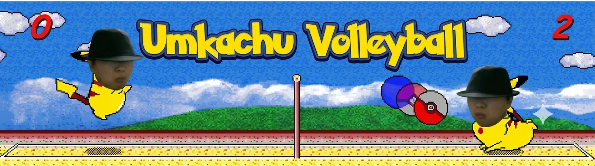
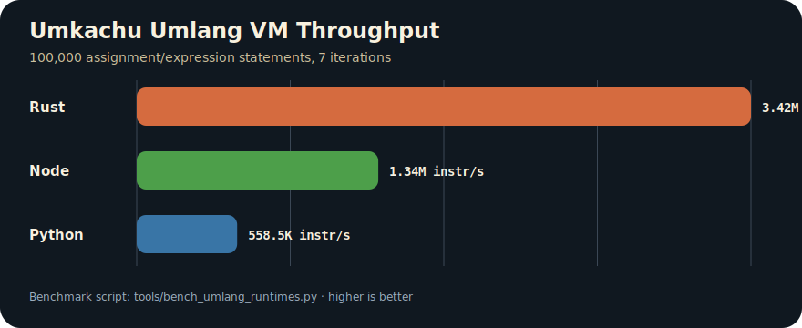
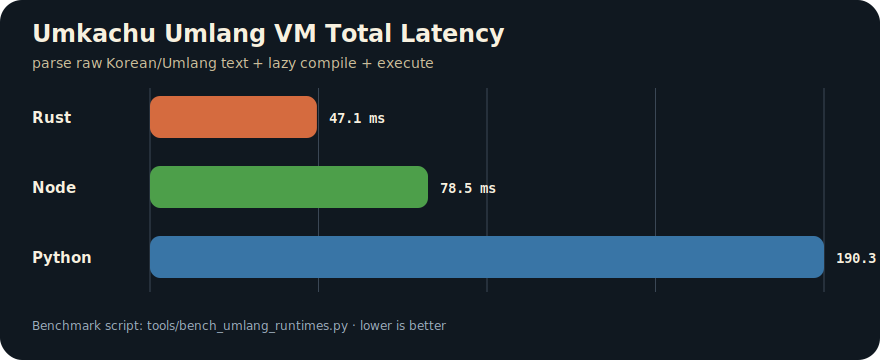

<p align="center">
  
</p>

<h1 align="center">⚡ Umkachu Volleyball Umlang ⚡</h1>

<p align="center">
  <strong>A Pikachu Volleyball adaptation in Umlang, the Korean internet-meme esolang, executed by a Rust Umlang VM.</strong>
</p>

<p align="center">
  <a href="README.ko.md">한국어 README</a>
  ·
  <a href="#-quick-start">Quick Start</a>
  ·
  <a href="#-core-of-umkachu">Core of Umkachu</a>
  ·
  <a href="#-architecture">Architecture</a>
  ·
  <a href="#-package-abi">Package ABI</a>
</p>

---

> Did Codex actually learn `umlang`, a Korean internet-meme language? This repo turns that question into a Pikachu Volleyball Umlang adaptation. 엄엄엄.

## 📚 Index

| Section | Signal |
| --- | --- |
| [About this project](#-about-this-project) | The project identity: Umkachu Volleyball as an Umlang-first game package. |
| [What is Umkachu?](#-what-is-umkachu) | A Pikachu Volleyball adaptation as a committed Umlang package. |
| [Quick Start](#-quick-start) | Run the full `.umm` package and the small core sample. |
| [Core of Umkachu](#-core-of-umkachu) | The actual Umlang sample code behind the game loop. |
| [Architecture](#-architecture) | Umlang source, package ABI, Rust VM, Host API, macroquad backend. |
| [Package ABI](#-package-abi) | The ABI files now live in `package/abi/`. |
| [Future Work](#-future-work-korean-native-programming-surface) | Moving Korean logic, tone, and context into programming-language design. |
| [Benchmark](#-profiling-benchmark) | Rust, Node.js, and Python-style Umlang runtime performance. |
| [Research Notes](#-research-notes) | Esolang-as-IR, private dialects, and agent-tuned language design. |
| [Controls](#-controls) | Keyboard actions. |
| [Development](#-development) | Rust-only build and validation commands. |

## 🟡 About this project

`umkachu-volleyball-umlang` carries Pikachu Volleyball as **Umlang** source:

```text
scripts/pikachu.umm
  -> 가져와 scripts/pikachu_parts/pikachu_0000.umm
  -> 가져와 scripts/pikachu_parts/pikachu_0001.umm
  -> ...
```

The `.umm` files are the game-facing program. Rust is the language runtime: it parses Umlang, expands
`가져와` imports, executes variable/jump/output instructions, and exposes a Host API for windowing,
textures, audio, keyboard input, settings, timing, and frame pacing.

```text
Umlang owns the game package.
Rust owns the VM/backend that lets that package touch the machine.
```

This repository is intentionally shaped like a language adaptation, not like a Rust game with a mascot skin.
Game constants, sprite layout, palette, key bindings, SFX policy, timing, menu curves, and VM variable slots
are moved into package ABI files under [`package/abi`](package/abi).

## 🧠 What is Umkachu?

**Umkachu Volleyball** is a Pikachu Volleyball adaptation packaged as committed Umlang `.umm` source. It still
has a window, ball, players, score, menu, keyboard input, and audio, but the game-facing source is the Umlang
package rather than ordinary Rust gameplay code.

Umlang itself is an esoteric language inspired by the Korean internet meme around `엄준식`. This repository
uses the public token feel documented by [`rycont/umjunsik-lang`](https://github.com/rycont/umjunsik-lang)
and links the meme context through
[`엄준식(인터넷 밈)`](https://namu.wiki/w/%EC%97%84%EC%A4%80%EC%8B%9D%28%EC%9D%B8%ED%84%B0%EB%84%B7%20%EB%B0%88%29).

The important point is not just "what is Umlang?" The point is that Umlang is used here as the actual game
package surface:

```text
scripts/pikachu.umm
  -> main Umlang game entry
scripts/pikachu_parts/*.umm
  -> imported Umlang body chunks for player, ball, menu, render, input, audio, timing
package/abi/*.txt
  -> syscall, variable-slot, key, sprite, and physics contracts shared with the Rust VM
```

This runner accepts the following Umkachu-facing Umlang shapes:

| Umlang | Umkachu meaning |
| --- | --- |
| `어떻게` | Start the Umkachu package. |
| `이 사람이름이냐ㅋㅋ` | End the Umkachu package. |
| `가져와 path.umm` | Import large game body chunks. |
| `엄.....` / `어엄.....` | Store numbers in VM variable slots. |
| `식어!` | Execute graphics/audio/input/frame syscalls. |
| `준.....` | Jump through game, menu, and frame loops. |
| `동탄...?...` | Handle collision, input, and state-transition conditions. |

It looks like a joke. Inside the Umkachu VM, it is the source that moves Pikachu Volleyball.

## 🚀 Quick Start

### Run Umkachu Volleyball

```bash
cargo run
```

`cargo run` reads [`package/abi/umlang-package.txt`](package/abi/umlang-package.txt), loads
[`scripts/pikachu.umm`](scripts/pikachu.umm), expands the chunked Umlang body, and starts the game.

### Run The Small Umlang Court

```bash
cargo run -- examples/umkachu-core.umm
```

This sample is a compact `.umm` file that draws a small court through the same VM and Host API.

### Inspect The Umkachu Entry

```umm
어떻게
가져와 scripts/pikachu_parts/pikachu_0000.umm
가져와 scripts/pikachu_parts/pikachu_0001.umm
가져와 scripts/pikachu_parts/pikachu_0002.umm
이 사람이름이냐ㅋㅋ
```

The full body is split into committed `.umm` parts so the package remains GitHub-friendly while staying
inside the repository as actual Umlang source.

## 🧩 Core of Umkachu

The checked-in sample lives at [`examples/umkachu-core.umm`](examples/umkachu-core.umm).

It is not pseudocode. It is real Umkachu Volleyball Umlang source: a tiny court loop that calls the Host API
and jumps back into the next frame.

```umm
어떻게
엄,,,,,,,,,,
어엄....................
어어엄.... .........................................................................
어어어엄............. ....
어어어어엄................ ..
어어어어어엄..
식어!
엄,,,,,,,,,
식어!
준................. ..
이 사람이름이냐ㅋㅋ
```

The core syscall pattern is:

```text
1. Put a Host API opcode into variable slot 1.
2. Put syscall arguments into variable slots 2, 3, 4...
3. Execute `식어!`.
4. The Rust VM dispatches the opcode to the Host API.
5. Umlang continues with jumps, variables, and frame yields.
```

That sample is the smallest readable version of the full Umkachu Volleyball loop: put a Host opcode in
Umlang variable slot 1, put arguments in later slots, execute `식어!`, then jump back into the frame loop.
The full package uses the same pattern with many more `.umm` chunks for player physics, ball collision, menu,
sprite drawing, score, and audio events.

Another excerpt from the full package entry shows how the real body is imported:

```umm
어떻게
가져와 scripts/pikachu_parts/pikachu_0000.umm
가져와 scripts/pikachu_parts/pikachu_0001.umm
가져와 scripts/pikachu_parts/pikachu_0002.umm
이 사람이름이냐ㅋㅋ
```

## 🏗 Architecture

```text
┌────────────────────────────────────────────────────────────┐
│ Umlang package                                             │
│ scripts/pikachu.umm + scripts/pikachu_parts/*.umm          │
└──────────────────────────────┬─────────────────────────────┘
                               │ 가져와/import expansion
┌──────────────────────────────▼─────────────────────────────┐
│ Package ABI                                                 │
│ package/abi/umlang-*.txt                                    │
└──────────────────────────────┬─────────────────────────────┘
                               │ constants, slots, assets, keys
┌──────────────────────────────▼─────────────────────────────┐
│ Rust Umlang VM                                              │
│ parse -> line IR -> variable slots -> jumps -> syscall      │
└──────────────────────────────┬─────────────────────────────┘
                               │ negative/output dispatch
┌──────────────────────────────▼─────────────────────────────┐
│ Host API                                                    │
│ draw, texture, audio, input, settings, timing, frame yield   │
└──────────────────────────────┬─────────────────────────────┘
                               │ backend calls
┌──────────────────────────────▼─────────────────────────────┐
│ macroquad/Rust backend                                      │
│ window, GPU, keyboard, audio, filesystem settings           │
└────────────────────────────────────────────────────────────┘
```

| Layer | Responsibility |
| --- | --- |
| `.umm` package | Game-facing executable source and imported body chunks. |
| `package/abi` | Stable data contract shared by the VM, host, tests, and Umlang package. |
| Rust VM | Umlang parser, import expander, lazy bytecode compiler, jump engine, syscall dispatcher. |
| Host API | Device boundary for graphics, input, audio, settings, arithmetic helpers, frame yield. |
| macroquad | Concrete desktop backend. |

The VM preserves the Korean/Umlang source surface. It does not need to re-interpret Hangul strings forever:
the source is loaded as text, then each executed line is compiled once into a small internal instruction and
cached. The visible language stays Umlang; the hot path becomes VM bytecode.

## 📦 Package ABI

All ABI files are grouped under [`package/abi`](package/abi):

| ABI | Owned data |
| --- | --- |
| `package/abi/umlang-package.txt` | Main script path, asset root, VM frame budget, settings prefix, window options. |
| `package/abi/umlang-syscalls.txt` | Host opcode numbers shared by Rust and the Umlang package. |
| `package/abi/umlang-keycodes.txt`, `package/abi/umlang-keymap.txt` | Physical key codes and game action bindings. |
| `package/abi/umlang-assets.txt` | Texture/audio slots, BGM/SFX banks, asset id policy inputs. |
| `package/abi/umlang-palette.txt` | Color id to RGBA palette. |
| `package/abi/umlang-settings.txt` | Runtime setting keys, defaults, allowed values. |
| `package/abi/umlang-vars.txt` | VM variable slot ABI used by the Umlang package. |
| `package/abi/umlang-game.txt` | Game constants, physics, phases, court/player/ball defaults. |
| `package/abi/umlang-player.txt` | Player state ids and movement/power/lying/win-lose transition thresholds. |
| `package/abi/umlang-sprites.txt` | Player and ball atlas frame coordinates. |
| `package/abi/umlang-rng.txt` | Original-style 64-bit LCG seed/multiplier bytes. |
| `package/abi/umlang-render.txt` | Background, score, intro, menu, phase message, and playfield render layout. |
| `package/abi/umlang-animation.txt` | Player state animation rules and draw-state sprite maps. |
| `package/abi/umlang-sfx.txt` | Round/UI SFX event flags, sound ids, and side policy. |
| `package/abi/umlang-timing.txt` | Intro/menu/phase fade frames, message growth, ready blink, game-end timing. |
| `package/abi/umlang-menu.txt` | Menu sitting tiles, fight message pulse, title curve, selected-option pulse. |

## 🧭 Future Work: Korean-Native Programming Surface

The larger question behind this repo is: does a programming language have to be centered on English keywords?
Umlang starts as a joke, but it points at a real possibility: Korean can be a programming surface too.

This is not just translating `if`, `for`, and `return` into Korean words. Korean carries particles, endings,
omission, hierarchy, meme tone, and community context. A Korean-native language could make control flow feel
like contextual Korean speech: "is this right?", "then skip it", "if that worked, move on", instead of only
copying the shape of mainstream programming languages.

Future work is a more Korean programming surface:

| Direction | Meaning |
| --- | --- |
| Korean-native syntax | Control flow designed around Korean sentence feel, not direct English keyword translation. |
| Context-aware logic | A VM/parser that can distinguish particles, endings, tone, and meme expressions. |
| Dialect packs | Per-company, per-community, or per-game Umlang dialects with their own ABI. |
| Agent rules | Codex/Claude rules tuned to read and edit Korean-context code intentionally. |

Umlang looks unserious on purpose. That is the point: code can carry Korean humor, context, and logic without
asking permission from English-first language design.

## 📊 Profiling Benchmark

The benchmark separates VM execution from graphics/audio, then adds one real-package measurement for
`scripts/pikachu.umm` reaching the first game-frame yield.

<p align="center">
  
</p>
<p align="center"><em>Figure 1. Umkachu Umlang VM throughput by runner: Rust, Node.js, and Python-style implementations.</em></p>

<p align="center">
  
</p>
<p align="center"><em>Figure 2. Umkachu Umlang VM total latency by runner: parse + lazy compile + execute.</em></p>

The benchmark was generated by [`tools/bench_umlang_runtimes.py`](tools/bench_umlang_runtimes.py). It builds the
release Rust benchmark binary in [`src/bin/um_bench.rs`](src/bin/um_bench.rs), runs the same Umlang micro workload
through Rust/Node.js/Python implementations, then runs the real [`scripts/pikachu.umm`](scripts/pikachu.umm)
package with a no-op Host API until the first frame yield.

### Umkachu Umlang VM Throughput Table

| Runner | Workload | Throughput | Rust-relative | Signal |
| --- | --- | ---: | ---: | --- |
| Rust | 100,000 Umkachu/Umlang assignment-expression ops | 3,501,623 instr/s | 1.00x | Baseline runner used by the Umkachu package. |
| Node.js | 100,000 Umkachu/Umlang assignment-expression ops | 1,462,814 instr/s | 0.42x | JavaScript runner signal for a future Node backend. |
| Python | 100,000 Umkachu/Umlang assignment-expression ops | 553,960 instr/s | 0.16x | Python-style runner signal for scripting-heavy experiments. |

### Full Benchmark Table

| Runtime | Workload | Mean parse | Mean run | Mean total | Throughput |
| --- | --- | ---: | ---: | ---: | ---: |
| Rust | 100,000 Umlang assignment/expression statements | 14.562 ms | 28.558 ms | 43.121 ms | 3,501,623 instr/s |
| Node.js | 100,000 Umlang assignment/expression statements | 8.007 ms | 68.361 ms | 76.369 ms | 1,462,814 instr/s |
| Python | 100,000 Umlang assignment/expression statements | 16.706 ms | 180.518 ms | 197.225 ms | 553,960 instr/s |
| Rust | `scripts/pikachu.umm` first frame | 1809.346 ms | 8.695 ms | 1818.041 ms | - |

For the Pikachu Volleyball port, this matters because the checked-in `.umm` package is intentionally large.
Fast VM dispatch gives the port more budget for physics, AI, input handling, render syscalls, and frame pacing.
Rust remains the practical Host/API bridge, while the Node.js and Python profiles give baseline costs for
alternative runner experiments.

Reproduce:

```bash
python3 tools/bench_umlang_runtimes.py
```

Detailed output lives in [`docs/benchmarks`](docs/benchmarks).

## 🧪 Research Notes

Umkachu treats an esolang as a project IR. The starting question is deliberately weird:
could a general coding agent understand a Korean internet-meme language, and what happens if a project pushes
that language all the way into a real game package?

| Angle | Geek value |
| --- | --- |
| Runtime sovereignty | The project owns syntax, ABI, VM semantics, syscalls, and tests. |
| Dialect compression | Game concepts become project-specific instructions and data contracts. |
| Agent specialization | Codex/Claude rules can target the dialect, ABI invariants, and checked-in `.umm` package. |
| Private dialect security | A company can pair a custom language, private VM, signed packages, and strict agent rules to narrow the legal move space. |

### LLMs And Private Dialects

GPT-class models may have seen public `umjunsik-lang` material. That answer is a little disappointing if the
hope was: "use a strange language and get excellent security for free." But the disappointment is exactly the
research angle.

A model may know the public meme language, but it should not be assumed to know a company's private Umlang
dialect, ABI, verifier, package format, interpreter behavior, or Host API policy. Instead of trusting model
mystery, an organization can own the language surface and the execution surface together. Internal agents get
project-specific rules; outsiders only see an unfamiliar source surface unless they also have the interpreter,
ABI, and runtime policy.

### Security Significance

A private language is not cryptography by itself. Still, there is a real organization-level security angle:
the language, interpreter, verifier, ABI, Host API, and agent rules can be owned and enforced together.

```text
organization-specific language
  + private interpreter / verifier
  + signed package ABI
  + sandboxed Host API
  + audit logs
  + Codex/Claude rules tuned to the dialect
  = narrower and more enforceable development surface
```

That can improve policy enforcement, review discipline, reproducibility, and accidental data-flow control.
The language itself is closer to obfuscation and control-surface design than encryption, but paired with
signing, sandboxing, permissions, secrets management, audit logs, review, and monitoring, it becomes a
practical private development surface.

## 🎮 Controls

| Key | Action |
| --- | --- |
| Arrow keys / mapped movement keys | Player movement through package key ABI. |
| Power key | Jump, power hit, dive, or menu confirm depending on phase. |
| `Space` | Pause/resume. |
| `Backspace` | Restart intro. |
| `P` | Practice mode toggle. |
| `1`, `2`, `3` | Winning score 5/10/15. |
| `[`, `]`, `\` | Target FPS 20/30/25. |
| `B` | BGM toggle. |
| `S` | SFX mode Stereo/Mono/Off. |
| `X` | Soft/sharp texture filter. |

## 🛠 Development

Rust-only validation path:

```bash
cargo fmt --check
cargo check
cargo test generated_menu_abi_defines_original_menu_animation_curves
cargo test generated_pikachu_script_reaches_first_frame_yield
```

Full `cargo test` also works, though tests that execute the large committed Umlang package take longer.

## 🧾 Provenance

Asset provenance and redistribution notes are kept in [`docs/attribution.md`](docs/attribution.md).
The Umlang language feel and public core tokens are credited to
[`rycont/umjunsik-lang`](https://github.com/rycont/umjunsik-lang).

## 🔗 Umlang Repos

| Repo | Note |
| --- | --- |
| [`rycont/umjunsik-lang`](https://github.com/rycont/umjunsik-lang) | Public Umlang reference for the core token feel. |
| [`NomaDamas/umkachu-volleyball-umlang`](https://github.com/NomaDamas/umkachu-volleyball-umlang) | This Pikachu Volleyball adaptation as a committed Umlang package. |
